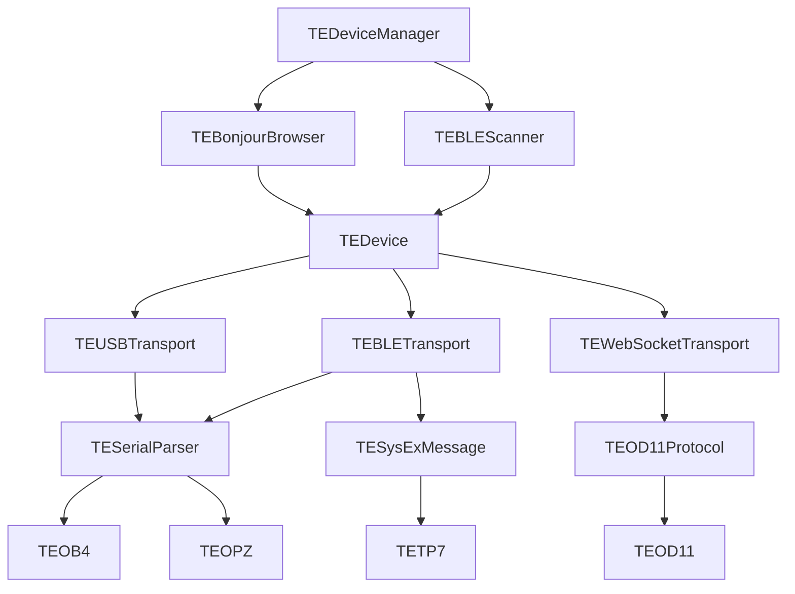

# TEKit

A Swift library for communicating with [Teenage Engineering](https://teenage.engineering) devices. Supports discovery, connection, and control over BLE, USB, and WebSocket.

## Supported Devices

| Device | Transport | Protocol |
|--------|-----------|----------|
| **OB-4** | BLE, USB | Serial |
| **OD-11** | WebSocket (Bonjour) | JSON-RPC |
| **OP-Z** | BLE, USB | Serial |
| **TP-7** | BLE | SysEx (MIDI) |

## Requirements

- Swift 6.3+
- iOS 17+ / macOS 14+
- USB transport requires macOS (CoreMIDI)

## Installation

Add TEKit as a Swift Package dependency:

```swift
dependencies: [
    .package(url: "https://github.com/ericlewis/TEKit.git", branch: "main")
]
```

## Usage

### Device Discovery

```swift
import TEKit

let manager = TEDeviceManager()
manager.startScanning()

for device in manager.devices {
    print("\(device.name) — \(device.type)")
}
```

### Connecting to a Device

```swift
try await device.connect()
```

### OB-4

```swift
let ob4 = TEOB4(device: device)

ob4.play()
ob4.pause()
ob4.setVolume(0.75)
ob4.switchSource(.bluetooth)
ob4.setFmFrequency(91.1)
ob4.knockKnock()
```

### OD-11

```swift
let od11 = TEOD11(device: device)

od11.join()
od11.setVolume(0.5)
od11.setBassBoost(0.3)
od11.nextTrack()
```

### OP-Z

```swift
let opz = TEOPZ(device: device)

opz.greet()
opz.requestVersion()
opz.requestPowerMode()
```

### TP-7

```swift
let tp7 = TETP7(device: device)

tp7.sendGreeting()
tp7.requestAudio(trackId: 1)
```

## Architecture



All device state is `@Observable` for direct use with SwiftUI.

## License

MIT
